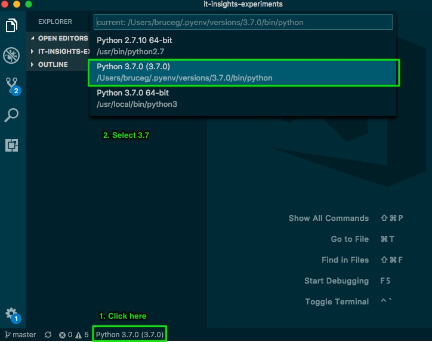

# bgou's new dev setup

This repo helps devs get setup quickly, and provides a central place for us to configure coding styles and other conventions.

Feel free to contribute like it's your own!

## OS wide tools

* [brew](https://brew.sh/) | MacOS package manager
* zsh | better shell than `bash`

  ```bash
  brew install zsh
  ```

* [oh-my-zsh](https://github.com/robbyrussell/oh-my-zsh) | zshell enhancement
* [iTerm2](https://www.iterm2.com/downloads.html) | better terminal
* [Visual Studio Code](https://code.visualstudio.com/download)
  * Feel free to also use [sublime text](https://www.sublimetext.com/3), but we spend most of time in vscode

## Git

* Open `~/.gitconfig`, setup your name and email
* Copy and paste content from [gitconfig](./dotfiles/gitconfig) into it while setting up your user name and email
* Copy [global_gitignore](./dotfiles/global_gitignore) to `~/.global_gitignore`

## Node

* Node version manager [nvm](https://github.com/creationix/nvm)
* Install node v11:

  ```bash
  nvm install 11
  nvm alias default 11
  ```

* Setup path to look at executables in the current directory, then local node packages

  ```bash
  # Add this line to ~/.zshrc
  export PATH=".:./node_modules/.bin/:$PATH"
  ```

## Python3

* Python environment manager

  ```bash
  brew install pyenv
  pyenv install 3.7.0
  ```

  add this line to `~/.zshrc`

  ```bash
  export PYENV_VERSION=3.7.0
  ```

  This sets up your environment to use python3 by default (MacOS defaults to 2.7)

* Visual Studio and Python
  * Make sure you set python3 as default
  * 

## Visual Studio Code Extensions

* [Prettier](https://marketplace.visualstudio.com/items?itemName=esbenp.prettier-vscode)
* [TSLint](https://marketplace.visualstudio.com/items?itemName=eg2.tslint)
* [ESLint](https://marketplace.visualstudio.com/items?itemName=dbaeumer.vscode-eslint)
* [Markdown Lint](https://marketplace.visualstudio.com/items?itemName=DavidAnson.vscode-markdownlint)
* [ES7 React/Redux/GraphQL/React-Native snippets](https://marketplace.visualstudio.com/items?itemName=dsznajder.es7-react-js-snippets)
* [Debugger for chrome](https://marketplace.visualstudio.com/items?itemName=msjsdiag.debugger-for-chrome)

## Chrome extensions

* [Tampermonkey](https://chrome.google.com/webstore/detail/tampermonkey/dhdgffkkebhmkfjojejmpbldmpobfkfo) | _Automatically check the "Remove Source Branch" checkbox when creating a merge request_
  * After installation:
    1. Open the extension's dashboard
    2. Click on the +
    3. Add the content of [this file](./monkey-scripts/gitlab-mr-template-injector.js) to the editor
    4. Save
* [JSON Viewer](https://chrome.google.com/webstore/detail/json-viewer/gbmdgpbipfallnflgajpaliibnhdgobh) | _View formatted JSON directly in browser_
